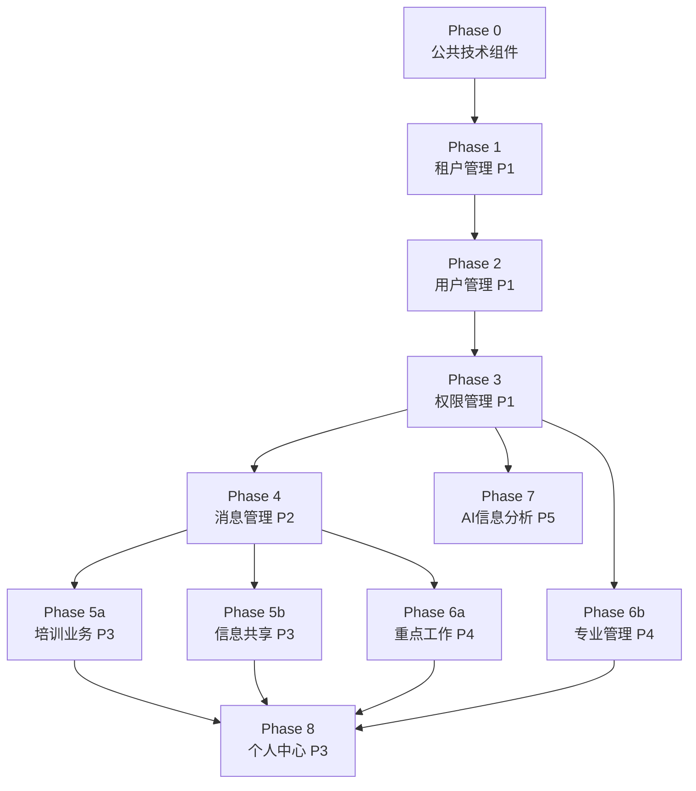

# 开发顺序分析

基于 11 个提案的模块依赖关系、优先级和技术耦合度，推荐以下开发顺序。

## 依赖关系图



## 推荐开发阶段

### Phase 0 — 技术基座

| 模块 | 工作内容 | 预估工时 |
|------|---------|---------|
| **公共技术组件约定** | Tailwind CSS 集成、6 个布局组件（AppLayout/TopNavBar/DrawerMenu/BottomTabBar/PageFooter/SideMenu）、MarkdownViewer、AttachmentUploader/List、VisibilitySetter、Artalk 集成、history-manager-component 集成 | 5-7天 |

> [!IMPORTANT]
> 这是所有模块的基础。布局组件决定了全部前台页面的骨架，必须先完成并稳定。

---

### Phase 1 — 租户管理（P1）

| 模块 | 依赖 | 关键交付物 |
|------|------|-----------|
| **租户管理** | Phase 0 | `xc-tenants` 集合、`tenantFilter` 中间件、部门树 CRUD、`DeptSelector` 组件 |

**为什么先做**：`tenantFilter` 中间件是所有业务接口的数据隔离层，后续每个模块的云函数都需要它。

---

### Phase 2 — 用户管理（P1）

| 模块 | 依赖 | 关键交付物 |
|------|------|-----------|
| **用户管理** | Phase 1 | 微信登录（OAuth+扫码）、`uni-id-users` 扩展字段、登录页、个人信息页、后台用户列表页 `listforsystem.vue` |

**为什么在租户后**：用户注册后需绑定 `tenant_id`，首次登录信息补全依赖部门选择器。

---

### Phase 3 — 权限管理（P1）

| 模块 | 依赖 | 关键交付物 |
|------|------|-----------|
| **权限管理** | Phase 2 | `v-has-perm` 指令（参考 `$user.permission[]`）、403 页面 |

> [!TIP]
> 角色管理/菜单管理/接口校验/导航动态渲染均已有，本阶段仅需实现 `v-has-perm` 自定义指令和 403 页面。工作量最小。

---

### Phase 4 — 消息管理（P2）

| 模块 | 依赖 | 关键交付物 |
|------|------|-----------|
| **消息管理** | Phase 3 | 消息推送服务（`service/admin/wx-push/`）、消息中心页面、微信菜单管理、`BadgeIcon` 组件 |

**为什么在权限后**：消息推送需要用户和角色信息；后续培训/信息/重点工作的「发布时触发消息推送」都依赖这个模块的推送服务。

---

### Phase 5 — 业务模块（可并行）

以下两个模块相互独立，可由不同开发人员并行开发：

| 模块 | 依赖 | 关键交付物 |
|------|------|-----------|
| **5a 培训业务** (P3) | Phase 4 | 课程列表/详情页、Video.js 播放器、cherry-markdown 编辑器、Artalk 留言、观看进度 |
| **5b 信息共享** (P3) | Phase 4 | 分类导航 `CategoryNav`、信息列表/详情页、阅读记录 |

---

### Phase 6 — 业务模块（可并行）

| 模块 | 依赖 | 关键交付物 |
|------|------|-----------|
| **6a 重点工作** (P4) | Phase 4 | 分类+集合管理、手风琴列表、三段式详情页、tiptap 编辑器、验收流程、`UserPicker` 组件 |
| **6b 专业管理** (P4) | Phase 3 | FullCalendar 日历、`OrgChart` 组织图、制度文档管理、我的文档功能 |

> [!NOTE]
> 专业管理不依赖消息模块（无「发布时推送」需求），因此可以与 Phase 5 并行，只需 Phase 3 完成即可。

---

### Phase 7 — AI信息分析（P5）

| 模块 | 依赖 | 关键交付物 |
|------|------|-----------|
| **AI信息分析** | Phase 3 | AI项目配置、提示词编辑器、分析执行流程、PDF生成、API Key 加密管理 |

> [!NOTE]
> 仅后台模块，不依赖消息推送，与 Phase 5-6 可并行。放在 Phase 7 是因为优先级最低（P5）。

---

### Phase 8 — 个人中心（P3）

| 模块 | 依赖 | 关键交付物 |
|------|------|-----------|
| **个人中心** | Phase 5 + 6 | `UserCard`、`GridMenu`、聚合数据展示（任务/反馈/阅读/培训/工作）、通知设置 |

**为什么最后做**：个人中心是纯聚合模块，从培训、信息、重点工作、专业管理各模块读取数据，必须在这些模块完成后才有数据可聚合。

---

## 总结：关键路径

```
Phase 0 → 1 → 2 → 3 → 4 → 5a/5b → 6a → 8
                          ↘ 6b (可提前)
                          ↘ 7  (可提前)
```

**最短关键路径**：Phase 0 → 1 → 2 → 3 → 4 → 5a → 8（约 7 个阶段）

**并行优化后**：如有 2 人，Phase 5a+5b 并行、Phase 6a+6b 并行，可压缩到约 6 个阶段完成。
