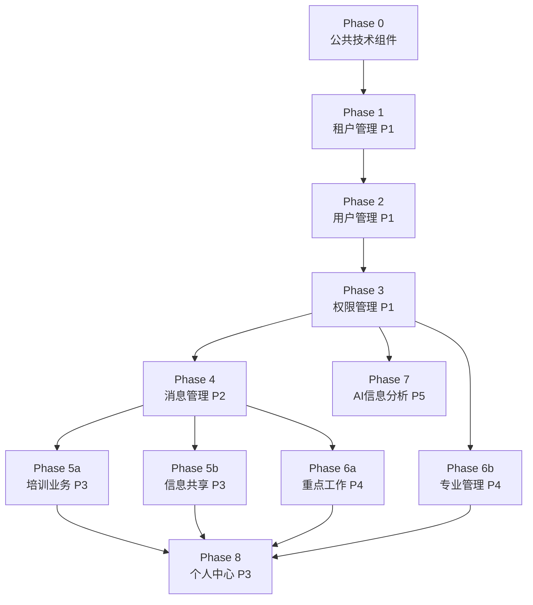

# Agent 对话导出（2026-03-10 以后）

> 导出时间：2026-03-15
> 包含 4 个对话，共 23 个工件文档

---

## 目录

1. [对话一：创建 vk-fun 技能（3月12日）](#对话一创建-vk-fun-技能)
2. [对话二：创建 vk-fun 技能（续）（3月12日）](#对话二创建-vk-fun-技能续)
3. [对话三：更新功能规格说明书（3月13日）](#对话三更新功能规格说明书)
4. [对话四：实施 Admin 页面（3月13-14日）](#对话四实施-admin-页面)

---

# 对话一：创建 vk-fun 技能

**ID**: `1d0facd8-3a94-45af-a00b-5ce4aed646e7`
**日期**: 2026-03-12

## 用户提示词概述

> 用户要求使用 `writing-skills` 技能创建一个名为 `vk-fun` 的新技能，用于规范化云函数开发和 `vk-unicloud-router` 框架的使用。具体目标包括：
> 1. **纳入文档**：将 `doc/client` 和 `doc/admin` 目录下的所有规范文档 100% 纳入该技能
> 2. **规范云函数开发**：确保涉及云函数调用或开发的项目遵循 `vk-fun` 技能中定义的标准
> 3. **JS API 文档化**：记录 `vk-unicloud-router` 框架中 JavaScript API 的用法
> 4. **前后端路由用法**：基于现有文档说明前端和后端的路由使用方式

## 目标

创建 `vk-fun` 技能，规范化 `vk-unicloud-router` 框架下的云函数开发，100% 纳入 `doc/client` 和 `doc/admin` 中的所有规范。

---

### 实施计划

#### 技能定位

- **类型**：Reference（参考指南）
- **触发场景**：项目中涉及调用云函数、编写云函数、使用 vk.pubfn JS API 时
- **安装位置**：`.agent/skills/vk-fun/`

#### 文件结构

```
vk-fun/
  SKILL.md                  # 主文件：概述 + 核心规范 + 触发条件
  cloud-function-guide.md   # 云函数编写规范（路由模式、中间件、service目录结构）
  client-api-reference.md   # 前端调用规范（vk.callFunction、页面跳转、弹窗等）
  admin-api-reference.md    # 后台 admin 端调用规范（万能表格、万能表单、vk-data-dialog）
  jsapi-reference.md        # vk.pubfn.* JS API 完整参考（前后端通用 + 前端专属 + 云函数专属）
  code-style.md             # Prettier 代码格式化配置规范
```

#### 各文件内容来源

| 技能文件 | 源文档 |
|----------|--------|
| `SKILL.md` | 框架概述 + 触发条件 + 快速参考表 |
| `cloud-function-guide.md` | `doc/client/pages/callFunction.md`、`doc/client/uniCloud/` |
| `client-api-reference.md` | `doc/client/pages/callFunction.md`、`doc/client/jsapi.md` |
| `admin-api-reference.md` | `doc/admin/` 全部文档 |
| `jsapi-reference.md` | `doc/client/jsapi.md` |
| `code-style.md` | `doc/client/codeFormat.md` |

---

### 完成报告

| 文件 | 大小 | 内容 |
|------|------|------|
| `SKILL.md` | 4.9KB | 主入口：触发条件、框架概述、快速参考表、核心规范索引 |
| `cloud-function-guide.md` | 7.4KB | 目录结构约定、云函数模板、vk.baseDao 数据库操作、中间件、并发执行 |
| `client-api-reference.md` | 7.2KB | vk.callFunction 三种调用方式、防重复提交、弹窗/跳转/事件/权限 |
| `admin-api-reference.md` | 12.5KB | 万能表格 vk-data-table、万能表单 vk-data-form、CRUD 完整模板 |
| `jsapi-reference.md` | 9.0KB | vk.pubfn.* API 完整参考（通用/前端专属/云函数专属） |
| `code-style.md` | 2.6KB | Prettier 配置、HBuilderX 设置、批量格式化 |

**总计：6 个文件，约 43.6KB**

#### 文档来源覆盖

| 源文档 | 纳入的技能文件 |
|--------|----------------|
| `doc/client/jsapi.md` (2335行) | `jsapi-reference.md` + `client-api-reference.md` |
| `doc/client/pages/callFunction.md` | `client-api-reference.md` + `SKILL.md` |
| `doc/client/pages/callFunctionForUrl.md` | `client-api-reference.md` |
| `doc/client/vk-unicloud-router.md` | `SKILL.md` |
| `doc/client/codeFormat.md` | `code-style.md` |
| `doc/client/serverless.md` | `SKILL.md`（概念纳入） |
| `doc/client/quickstart.md` | `SKILL.md`（初始化流程） |
| `doc/admin/README.md` | `admin-api-reference.md` |
| `doc/admin/2/table.md` (1911行) | `admin-api-reference.md` |
| `doc/admin/3/form.md` (1290行) | `admin-api-reference.md` |

---

# 对话二：创建 vk-fun 技能（续）

**ID**: `c1eed8f4-8c97-4f08-885a-b965ac9db27a`
**日期**: 2026-03-12

## 用户提示词概述

> 本对话为对话一的延续，用户继续推进 `vk-fun` 技能的创建工作，目标与对话一一致。

此对话为上一对话的延续，未产生独立工件文档。

---

# 对话三：更新功能规格说明书

**ID**: `de1f4586-10fc-4593-8406-cd2e965c1c80`
**日期**: 2026-03-13

## 用户提示词概述

> 用户的主要目标是确保所有功能规格说明书准确反映修订后的需求文档（`full-requirements.txt`）。具体包括：
> 1. **spec-kit 中文化**：将 `spec-kit` 工具的语言设置为中文，创建中文模板
> 2. **路径修正**：全面更新所有生成的规格文件中的「路径/配置约束」部分，修正残留的旧路径（如 `pages_plugs/` → `pages/`）
> 3. **用户故事更新**：更新各规格文件中的用户故事描述，使其与项目既定约定保持一致
> 4. **开发顺序分析**：基于 11 个提案的依赖关系和优先级，规划模块开发顺序

## 目标

将 `spec-kit` 工具中文化，并确保所有功能规格说明书准确反映最新需求文档。

---

### spec-kit 中文化方案

创建 `.specify/config.json`，设定 `"language": "zh-CN"`。

### 模板中文化（6 个文件）

| 文件 | 说明 |
|------|------|
| `plan-template.md` | 实施方案模板 |
| `spec-template.md` | 功能说明书模板 |
| `tasks-template.md` | 任务清单模板 |
| `checklist-template.md` | 检查清单模板 |
| `agent-file-template.md` | 开发指南模板 |
| `constitution-template.md` | 宪法模板 |

### 项目宪法

已将完整宪法写入 `constitution.md`，涵盖七大章节：项目结构、已实现功能、云函数规范、前端布局、UI/UX 规范、提案配置、数据库与 JS API 规范。

### 新增 vk-fun 参考文件

| 文件 | 说明 |
|------|------|
| `service-template.js` | 云函数标准模板（全量解构 + 注释说明） |
| `database-examples.js` | 数据库操作全量示例（CRUD/连表/树形/原子/事务） |
| `js-api-examples.js` | JS API 调用全量示例（工具优先/路由鉴权/弹窗/分页） |

---

### 开发顺序分析

基于 11 个提案的模块依赖关系、优先级和技术耦合度，推荐以下开发顺序：

#### 依赖关系图



#### 推荐开发阶段

| 阶段 | 模块 | 关键交付物 | 预估工时 |
|------|------|-----------|---------|
| Phase 0 | 公共技术组件 | Tailwind CSS、6 个布局组件、MarkdownViewer、AttachmentUploader 等 | 5-7天 |
| Phase 1 | 租户管理 (P1) | `xc-tenants`、`tenantFilter` 中间件、部门树 CRUD、`DeptSelector` | - |
| Phase 2 | 用户管理 (P1) | 微信登录、`uni-id-users` 扩展字段、登录页、后台用户列表 | - |
| Phase 3 | 权限管理 (P1) | `v-has-perm` 指令、403 页面 | - |
| Phase 4 | 消息管理 (P2) | 消息推送服务、消息中心页面、微信菜单管理、`BadgeIcon` | - |
| Phase 5a | 培训业务 (P3) | 课程列表/详情、Video.js、cherry-markdown、Artalk、观看进度 | - |
| Phase 5b | 信息共享 (P3) | `CategoryNav`、信息列表/详情、阅读记录 | - |
| Phase 6a | 重点工作 (P4) | 分类+集合管理、手风琴列表、tiptap 编辑器、验收流程 | - |
| Phase 6b | 专业管理 (P4) | FullCalendar 日历、`OrgChart`、制度文档管理 | - |
| Phase 7 | AI信息分析 (P5) | AI项目配置、提示词编辑器、PDF生成、API Key 管理 | - |
| Phase 8 | 个人中心 (P3) | `UserCard`、`GridMenu`、聚合数据展示、通知设置 | - |

**关键路径**：Phase 0 → 1 → 2 → 3 → 4 → 5a/5b → 6a → 8（约 7 个阶段）

---

# 对话四：实施 Admin 页面

**ID**: `9bd664d6-b489-407a-aee7-6e58b801a611`
**日期**: 2026-03-13 至 2026-03-14

## 用户提示词概述

> 用户的主要目标是实施信息共享模块的后台管理页面，遵循实施计划和 vk-fun 技能约定。在此过程中，对话扩展到涵盖多个核心模块的完整头脑风暴与实施。具体包括：
> 1. **租户管理**：讨论部门层级建模（从无限层级改为固定两级 + `dept_level`）、`tenantFilter` 中间件设计、部门 CRUD 全套实现
> 2. **前端框架设计**：XC 前台页面整体框架搭建（Phase 0 技术基座），包括布局组件、设计系统、全量页面占位
> 3. **用户管理**：设计微信驱动的登录体系、开发者三阶段模式、小组管理、入驻审批流程、后台 6 页面
> 4. **消息管理**：站内消息 + 微信推送完整交付，devMode 壳模式设计，消息模板 CRUD
> 5. **信息共享**：7 轮 34 个问题的完整头脑风暴，分类导航、自建留言、阅读计数去重、cherry-markdown 编辑器，前后台全套实现
> 6. **权限管理**：盘点现有能力，规划 `v-has-perm` 指令和 `permissionFilter` 中间件

## 概览

这是最大的一个对话，包含多个模块的头脑风暴、设计、实施和走查。

---

## 4.1 租户管理 — 头脑风暴

**日期**: 2026-03-13

### 确认的设计决策

| # | 问题 | 决策 |
|---|------|------|
| Q1 | 部门停用拦截 | **C: 登录时拦截**，停用部门用户直接跳转提示页 |
| Q2 | `dept_path` 格式 | **B: _id 路径**。部门改为固定两级 |
| Q3 | 用户调动后数据归属 | **A: 数据留旧部门**，创建时锁定 `tenant_id` |
| Q4 | 管理员切换部门参数注入 | **A: 中间件自动**，`tenantFilter` 统一处理 |
| Q5 | `target_dept_ids` 匹配策略 | **A: 精确匹配**，查询时按 `dept_level` 判断方向 |
| Q6 | 过滤覆盖范围 | **超管免过滤**，仅判断是否超级管理员 |
| Q7 | 部室/车间层级建模 | **B: `dept_level` 数值字段**，值小的可向值大的分享 |

### 重大需求变更：固定两级 + dept_level 层级

| 维度 | 原提案 | 修正后 |
|------|--------|--------|
| 层级 | 无限层级树形嵌套 | **固定两级**（集团 → 部门） |
| 第一级 | 根部门 | 集团级（不挂用户，仅作容器） |
| 第二级 | 子部门（可嵌套） | 部门（部室/车间，挂用户） |
| 层级关系 | `dept_path` 前缀匹配 | **`dept_level` 数值**控制方向 |
| 信息流向 | 无约束 | **单向：部室 → 车间** |

### 部门结构示意

```
集团（Level 1, dept_level=0）── 不挂用户
├── 技术部（dept_level=10, 部室级）
├── 生产部（dept_level=10, 部室级）
├── 设备部（dept_level=10, 部室级）
├── 采矿车间（dept_level=20, 车间级）
└── 选矿车间（dept_level=20, 车间级）
```

### `tenantFilter` 中间件流程

```
请求进入 → tenantFilter
  ├─ 是超级管理员？ → 跳过过滤（或使用 selected_tenant_id）
  ├─ 用户 tenant_id 为空？ → 仅注入 visibility=public
  └─ 正常用户：注入 $or 条件
       ├─ tenant_id == user.tenant_id
       ├─ visibility == 'public'
       └─ visibility == 'targeted' AND
          target_dept_ids 包含 user.tenant_id AND
          发布者 dept_level ≤ user.dept_level
```

### `xc-tenants` 集合字段

| 字段 | 类型 | 说明 |
|------|------|------|
| `_id` | String | 主键 |
| `name` | String | 部门名称（必填） |
| `code` | String | 部门编码（必填唯一） |
| `parent_id` | String | 上级ID（集团级为 null） |
| `dept_path` | String | 层级路径 `/集团ID/部门ID` |
| `dept_level` | Number | 层级数值（0=集团, 10=部室, 20=车间） |
| `leader_id` | String | 负责人用户ID |
| `sort_num` | Number | 排序号 |
| `status` | Number | 0=停用, 1=启用 |
| `description` | String | 部门简介 |

---

## 4.2 租户管理 — 实施完成报告

**交付清单**：

- **数据层**：`xc-tenants.schema.json`
- **后台云函数**（9 个）：formRules / add / update / del / getList / getInfo / sort / addMember / removeMember / getMembers
- **核心中间件**：`tenantFilter.js`（dept_level=0 免过滤、部门级 `$or` 注入）
- **前台云函数**（2 个）：getMyDept / getDeptPath
- **前台页面**：App.vue 修改、dept-disabled.vue、info.vue、pages.json 修改
- **后台组件**：list.vue（部门管理页）、DeptSelector.vue、VisibilitySetter.vue

### 需要手动完成

1. 上传 Schema 到 UniCloud
2. 创建索引（code 唯一、parent_id、status、dept_level）
3. 初始化根部门
4. 后台菜单注册
5. 集成 DeptSelector 到 topWindow

---

## 4.3 XC 前端页面框架设计

**日期**: 2026-03-13
**范围**: xc 前台应用整体页面框架搭建（Phase 0 技术基座）

### 设计决策

| 决策项 | 结论 |
|--------|------|
| 首页展示 | 空白占位页（仅 AppLayout 容器 + 占位文案） |
| CSS 方案 | SCSS + CSS 自定义属性，暂不引入 Tailwind |
| TabBar "工作" | 独立工作台聚合页 `pages/workbench/index` |
| 框架范围 | 全量占位（~28 个 .vue 文件 + 6 个布局组件 + 设计系统） |

### 布局容器模式

```
┌─────────────────────────────────┐
│  TopNavBar (PC: 65px / H5: 44px)│
├──────────┬──────────────────────┤
│ SideMenu │    主内容区 (slot)    │  ← PC端可选显示 SideMenu
│ (可选)   │                      │
├──────────┴──────────────────────┤
│  PageFooter (仅PC端, 48px)      │
│  BottomTabBar (仅H5端, 50px)    │
└─────────────────────────────────┘
```

### 布局组件清单

| 组件 | 职责 |
|------|------|
| `AppLayout.vue` | 主布局容器，通过 `window.matchMedia` 检测 PC/H5 模式 |
| `TopNavBar.vue` | 顶部导航（PC 65px / H5 44px） |
| `DrawerMenu.vue` | H5 抽屉菜单（宽 75vw, max 300px） |
| `BottomTabBar.vue` | H5 底部 TabBar（50px），4 标签 |
| `PageFooter.vue` | PC 底部页脚（48px） |
| `SideMenu.vue` | PC 左侧二级菜单 |

### 全量页面清单

**主包 pages/**（20 页面）：首页、工作台、消息列表/详情、登录、403、培训(3页)、信息共享(2页)、重点工作(4页)、专业管理(5页)

**子包 pages_plugs/**（8 页面）：个人中心首页、个人信息、我的任务/反馈/阅读/培训/工作、设置

---

## 4.4 用户管理 — 头脑风暴

**日期**: 2026-03-14

### 决策总览

| # | 议题 | 决策 |
|---|------|------|
| 1 | 开发者模式定位 | **混合模式**：日常走账密、调试微信时切测试号、上线前正式号回归 |
| 2 | 后台新增页面数量 | **完整版 6 页面**（含租户设置页和租户审批页） |
| 3 | 裸号弹窗在开发环境的处理 | **跳过弹窗**：后台创建测试账号直接指定 `tenant_id` |
| 4 | 微信功能开发排期 | **最后一公里**：先完成全部非微信功能，最后集中联调 |
| 5 | 后台双模式菜单实现 | **框架原生角色绑定菜单**，零代码侵入 |

### 三阶段登录体系

1. **阶段 1（日常开发，90%时间）**：账密登录 + 后台直接创建测试账号
2. **阶段 2（微信联调）**：测试号跑通 H5 OAuth → PC 扫码 → 裸号弹窗
3. **阶段 3（上线回归）**：切换正式服务号，全量验证

### 后台新增页面（6 页面）

**集团级**：
- `listforsystem.vue` — 全局用户管理（DeptSelector + vk-data-table）
- `applications.vue` — 入驻审批

**租户级**：
- `settings.vue` — 租户信息（只读）
- `group/list.vue` — 小组管理（el-tree）
- `member/list.vue` — 成员分配（左侧小组树 + 右侧 vk-data-table）
- `applications.vue` — 本部门待审

---

## 4.5 用户管理 — 实施计划

### 架构改动

1. **组织架构扩展**：引入不受集团约束的无限层级内部小组（`xc-tenant-groups`）
2. **账号生产线倒挂**：所有人员通过微信扫码/静默授权产生记录，产生后为无部门状态（裸号），通过审批流程完成归属绑定

### 实施阶段

- **阶段 1**：数据库模型与过滤器升级
- **阶段 2**：强制微信驱动登录体系
- **阶段 3**：双模式后台管理
- **阶段 4**：前台基建与收尾

---

## 4.6 用户管理 — 实施完成报告

### 交付物统计

| Phase | 范围 | Task | 状态 |
|-------|------|------|------|
| 1 基建层 | 3 张新表 + 用户字段扩展 | 1-4 | ✅ |
| 2 安全中控 | tenantFilter 升级 + 菜单注入 | 5-6 | ✅ |
| 3 云函数 | 11 个云函数（含 2 个微信壳） | 7-10 | ✅ |
| 4 后台页面 | 6 个新页面（集团 2 + 租户 4） | 11-14 | ✅ |
| 5 前台页面 | DeptBindModal + profile.vue | 15-16 | ✅ |
| 6 收尾 | 提案文档修订 | 17 | ✅ |

**数据库**（4 新建 + 2 修改）、**云函数**（13 个）、**中间件**（tenantFilter 升级）、**后台页面**（6 个）、**前台组件**（2 新 + 1 修改 + 1 重写）

---

## 4.7 消息管理 — 头脑风暴

**日期**: 2026-03-14

### 决策记录

| # | 问题 | 决策 |
|---|------|------|
| Q1 | 实施顺序 | **一起做** — 站内消息+微信推送完整交付 |
| Q2 | 微信推送策略 | **壳模式** — devMode 开关，开发阶段只写 xc-messages |
| Q3 | 路径修正 | 前台 `xc/pages/message/`、后台 `xc-admin/pages_plugs/message/` |
| Q4 | 消息模板 | **完整 CRUD** — 建表+云函数+后台管理页 |
| Q5 | 存储模型 | **每人一行** — 企业<1000人，简单直接 |
| Q11 | 消息类型扩展性 | **动态类型** — 从模板表动态聚合 `biz_type` |
| Q12 | 消息删除能力 | **用户侧软删** — `is_deleted` |
| Q13 | 微信配置表设计 | **单行不加密** — schema 锁死读写权限 |
| Q14 | 手动推选人交互 | **部门树多选** |
| Q15 | 消息详情渲染 | **纯文本** |

### 推送调用链

```
业务云函数 (e.g. training/sys/publish.js)
  → require('../../util/messagePush.js')
  → messagePush.send({ receivers, template_key, variables, util })
     ├─ 1. 查 xc-message-templates 取模板
     ├─ 2. 批量写 xc-messages (每人一行)
     ├─ 3. devMode ? 跳过 : vk.openapi.weixin.h5.templateMessage.send()
     └─ 4. 更新 push_status (success/failed)
```

### 文件清单（~33 个文件）

- 3 张数据库表 + 1 公共工具 + 5 前台云函数 + 9 后台云函数 + 6 微信推送云函数 + 2 前台页面 + 2 前台组件 + 4 后台页面 + 1 菜单初始化

---

## 4.8 消息管理 — 实施完成报告

### 创建的文件

- **数据库**（4 文件）：xc-messages / xc-message-templates / xc-wx-config Schema + 索引
- **公共工具**：`messagePush.js`
- **云函数**（16 文件）：admin/wx-push(4) + admin/message(7) + client/message(5)
- **后台页面**（4）：wx-config / wx-menu / template / list
- **前台页面**（2）：list / detail
- **组件修改**：TopNavBar 接入 `loadUnreadCount` + 全局事件监听
- **菜单配置**：追加"消息管理"菜单组

### 待联调

- `messagePush.js` 中 `devMode` 默认为 `true`，正式上线前需改为 `false`
- 微信 API 调用需在真实微信环境验证

---

## 4.9 信息共享 — 头脑风暴

**日期**: 2026-03-14

### 决策记录（7轮，34个问题）

**关键决策**：
- Q1: 公共组件独立拆出先行创建
- Q2: Markdown 编辑器选用 cherry-markdown
- Q3: 左侧分类树 + 右上子分类 Tab
- Q6: 自建留言（不用 Artalk）
- Q7: 留言两层扁平
- Q8: 阅读双写+去重（首次 +1，重复仅更新时间）
- Q14: 草稿→预览→发布状态流转
- Q24: H5 端顶部两行 Tab 分类导航
- Q26: 后台左右分栏 + vk-data-table

### `xc-info-articles` Schema

```js
{
  _id, tenant_id, title, summary, content, cover_image,
  category_id, attachments: [], visibility, target_dept_ids: [],
  target_user_ids: [], allow_comment: true, view_count: 0,
  comment_count: 0, status: 0, is_deleted: false,
  publish_time, created_by, created_at, updated_by, updated_at
}
```

### 文件清单（~30 个文件）

- 4 张数据库表 + 1 初始数据 + 1 公共工具 + 1 中间件 + 6 前台云函数 + 11 后台云函数 + 2 前台页面 + 3 后台页面 + 1 菜单

### 前置依赖（7 个公共组件）

MarkdownViewer、MarkdownEditor、AttachmentUploader、AttachmentList、CommentSection、CategoryNav、VisibilitySetter

---

## 4.10 信息共享 — 实施完成报告

全部 15 个 Task 完成：
- 数据层（4 Schema + 初始数据）
- 公共工具（visibilityResolver + visibilityFilter 中间件）
- 后台云函数（11 个）
- 前台云函数（6 个）
- 后台页面（category / list / edit + 菜单&路由注册）
- 前台页面（list + detail）

所有 17 个云函数严格遵循 vk-fun 规范。

---

## 4.11 权限管理 — 头脑风暴

**日期**: 2026-03-14

### 已有能力（无需重建）

| 能力 | 路径/方式 |
|------|-----------||
| 角色 CRUD | `admin/system/role/sys/*` (7 个文件) |
| 权限 CRUD | `admin/system/permission/sys/*` (7 个文件) |
| 菜单 CRUD | `admin/system/menu/sys/*` (8 个文件) |
| 角色绑定权限/菜单 | `bindPermission.js` + `bindMenu.js` |
| 用户绑定角色 | `bindRole.js` |
| `$hasPermission()` | vk 内置 |
| `$hasRole()` | vk 内置 |
| 后台动态菜单渲染 | vk-admin 框架内置 |

### 需要新建

| 需求 | 说明 |
|------|------|
| `v-has-perm` 指令 | 前台按钮级权限 DOM 移除 |
| `permissionFilter` 中间件 | 接口级权限校验 |
| 403 页面 | 前台无权限提示 |
| `getPermCodes` 接口 | 前台获取用户权限码 |
| `getMenuList` 接口 | 前台获取用户可见菜单 |

### 待决策

权限控制粒度：A) 三层全建 / B) 先建两层 / C) 仅建页面级 — **待定**

---

*文档导出完毕*
