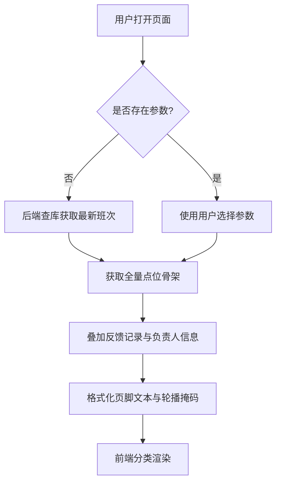

# 现场反馈展示功能优化设计方案 (2026-05-09)

## 1. 业务目标
修复现场反馈展示模块（showpoint.vue）的功能逻辑，包括班次判定、全局总览骨架展示、未反馈状态处理、大图查看以及单点位分析的分页展示。要求在不改动现有 UI 风格的前提下，提升数据的准确性和操作的流畅度。

## 2. 核心规则
### 2.1 班次时间逻辑
严格执行夜班跨天逻辑：
- **白班**：当日 08:00 至当日 20:00，对应的 `shift_date` 为当日，`shift_type` 为 `day`。
- **夜班**：前一日 20:00 至当日 08:00，对应的 `shift_date` 为当日，`shift_type` 为 `night`。

### 2.2 默认显示逻辑
首次加载或刷新时，系统不以当前物理时间为准，而是查询数据库中 `key-point-feedback` 表物理时间最晚的一条记录，将其 `shift_date` 和 `shift_type` 作为默认过滤条件。

## 3. 后端架构 (getLiveStatus.js)
采用“后端驱动”模式，减少前端逻辑复杂度。

### 3.1 全局总览模式 (mode: 'global')
1. **骨架生成**：查询 `base-area` 和 `base-point` 建立全量区域和点位的基础骨架。
2. **记录叠加**：根据选定日期和班次查询 `key-point-feedback`。
3. **状态合并**：
    - **已反馈**：状态为 1。使用实际拍摄照片；页脚：`YYYY-MM-DD 班次 HH:mm 由 部门姓名反馈`。
    - **未反馈**：状态为 0/2 或无记录。使用默认占位图；页脚：`YYYY-MM-DD 班次未反馈，责任人为：部门姓名列表`（需关联查询点位的负责人信息）。
4. **轮播图适配**：返回扁平化的照片数组，每个元素包含完整的点位描述和掩码信息。

### 3.2 单点位分析模式 (mode: 'single')
1. **数据拉取**：查询指定 `pointId` 在日期范围内的所有记录。
2. **数据处理**：按日期+班次进行分组（一个日期可能有两条记录），每条记录封装成与全局模式一致的“标准点位卡片”。
3. **分页支持**：支持 `pageIndex` 和 `pageSize`，返回 `list` 和 `total`。

## 4. 前端架构 (showpoint.vue)
### 4.1 视图逻辑
- **网格视图**：循环 `globalData`，展示区域标题和点位卡片。
- **轮播图视图**：将 `carouselList` 传递给 `live-status-carousel` 组件，支持点击大图预览。
- **单点位分析**：使用 `z-paging` 组件包裹列表，实现滚动加载和自动分页。

### 4.2 交互逻辑
- **图片预览**：点击任意反馈图片，调用 `uni.previewImage` 全屏显示。
- **状态同步**：日期和班次切换后，自动重新请求接口并更新 UI。

## 5. 数据流程图

## 6. 验证标准
- [ ] 班次逻辑符合 20:00 跨天规则。
- [ ] 全局总览即使无数据也显示所有点位（占位图状态）。
- [ ] 逾期未反馈点位正确显示负责人姓名。
- [ ] 点击图片可正常进入全屏预览。
- [ ] 单点位分析支持滚动加载，且白/夜班记录独立显示。
