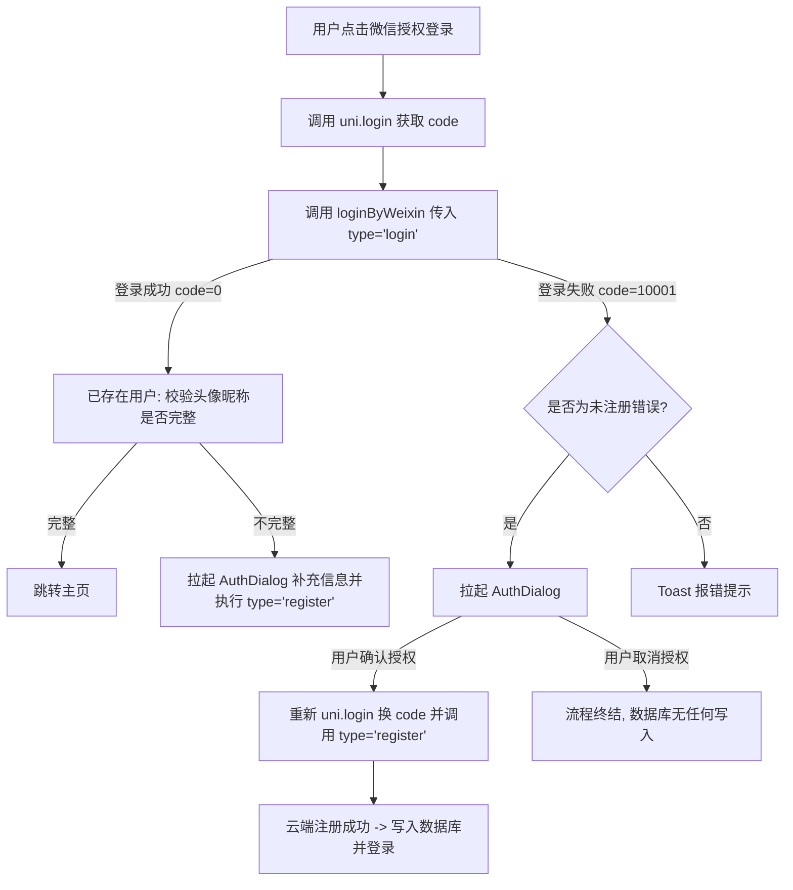

# 微信授权登录与全局路由拦截设计文档

## 1. 概述
在系统使用过程中，发现两个与登录授权、账号合规相关的逻辑缺陷：
1. **取消授权提前建档问题**：新用户在“微信授权登录”第一阶段（静默摸底）中，数据库即自动生成了一条未绑定头像昵称的空白用户记录。即使后续在头像昵称授权弹窗中选择“取消”，该数据库垃圾数据也已被写入。
2. **未完善信息/待审核用户绕过拦截问题**：在首页及部分核心功能页中，只校验了本地是否存在 `userInfo._id`，而未对 `audit_status` 进行强拦截校验，导致未完善信息或在审核中的用户可以通过重新启动、TabBar 切换直接进入业务系统主界面。

本设计旨在通过前端流程控制和全局 `onShow` Mixin 拦截，彻底修复上述安全与流程控制问题。

---

## 2. 方案详细设计

### 2.1 微信授权登录流程优化 (对应方案 1.1)

#### 2.1.1 核心逻辑调整
在 `pages/user/login/index.vue` 触发授权登录时：
* 发起底层的静默通信时，在请求 `client/user/pub/loginByWeixin` 中传入参数 `type: 'login'`。
* 该参数会使得云端登录逻辑变更为“仅登录，若用户不存在则直接报错，不自动注册”。
* 客户端若捕获到代表“未注册”的失败响应（通过错误码 `10001`、`90001`、`30201` 或错误文案中包含 `未注册`/`不存在`/`未绑定` 判定），则进入**新用户注册分支**：
  1. 拦截错误不向用户报错，直接拉起自定义头像昵称授权组件 `AuthDialog`。
  2. 用户在 `AuthDialog` 中补充头像与昵称，点击“确认授权”。
  3. 前端重新请求 `uni.login` 获取最新的 code，带着用户的头像昵称及 `type: 'register'` 再次请求 `client/user/pub/loginByWeixin` 以进行正式建档与注册。
  4. 若用户在 `AuthDialog` 中点击“取消”，则完全阻断流程，不对云端发起注册调用。

---

### 2.2 全局 Mixin 导航拦截设计 (对应方案 2.2)

#### 2.2.1 页面拦截白名单
为了防止用户登录态不正常时导致页面无限重定向死循环，以下基础页面划入白名单，不予以拦截：
* `pages/user/login/index` （登录页）
* `pages/user/register/index` （信息完善注册页）
* `pages/user/audit-status/index` （审核状态显示页）
* `pages/user/mine/index` （个人中心页，供不合规用户能够看到状态并可退出登录）
* `pages/index/visitor` （游客看板页）

#### 2.2.2 Mixin 拦截机制
在客户端 `main.js` (分别针对 Vue2 和 Vue3 的初始化环境) 中全局混入 `onShow` 生命周期钩子：
1. 从 `getCurrentPages()` 中提取当前活跃的页面路径 `route`。
2. 若 `route` 存在于白名单数组中，直接 `return` 结束执行。
3. 从 `store` (Vuex) 中提取最新的 `userInfo` 对象。
4. 若 `userInfo._id` 存在（即已登录，拥有 Token）：
   * 检查 `userInfo.audit_status`：
     * 若 `audit_status` 不等于通过状态 `3`：
       * 若状态为 `0` 或 `undefined`，使用 `uni.reLaunch` 重定向到注册页 `pages/user/register/index`。
       * 若状态为 `1` 或 `2`，使用 `uni.reLaunch` 重定向到审核状态页 `pages/user/audit-status/index`。

---

## 3. 校验与验证方案
1. **取消授权场景**：使用未注册的微信号登录，在头像昵称确认弹框中点击取消，检查 Space A 的 `uni-id-users` 数据库，确认无任何该微信号的新增记录。
2. **二次确认注册场景**：在前述头像昵称确认弹框中输入自定义头像和昵称点击确认，确认能在数据库中查到该微信号已成功建档并带有所填的数据。
3. **未完善信息绕过场景**：登录一个刚建档的新账号（`audit_status=0`），进入注册完善页面后关闭小程序，重新冷启动打开小程序，确认能立刻强制弹回注册页，无法看到首页操作控制台。
4. **审核中绕过场景**：登录一个已完善未审核的账号（`audit_status=1`），在微信开发者工具或真机中尝试通过 TabBar 切换各个核心功能页，确认每次页面被展现时都能秒级重定向到审核状态页。
