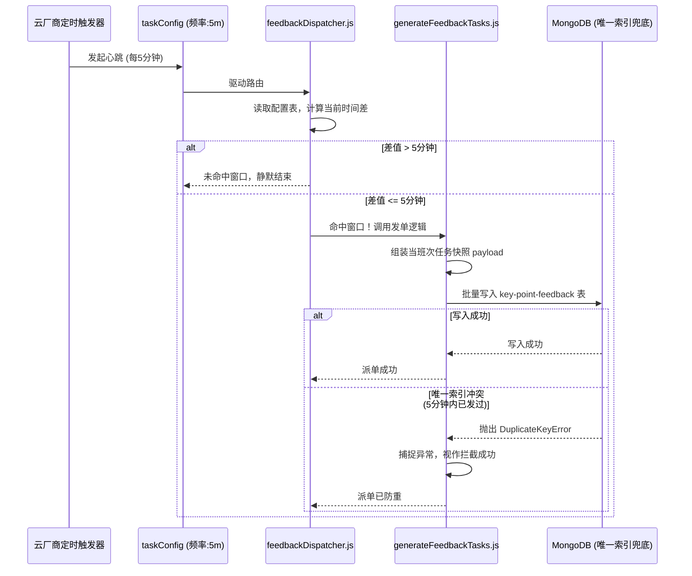

# 重控点位监督管理 - 定时派单动态调度机制

**文档状态**：已实施 (2026-04-30)

## 背景问题分析

在之前的实现中，定时任务生成的云函数 `generateFeedbackTasks.js` 采用了**精准时间字符串比对**的逻辑：
```javascript
let current_time_str = pubFun.timeFormat(now, "hh:mm");
if (current_time_str === triggerTime) {
    // 触发派单
}
```
**问题暴露**：
由于云端 Serverless 环境下定时器的调度（尤其是阿里云的 1 分钟最小粒度），无法保证代码执行的那一刻完全精准等于设定的 `HH:mm`。网络延迟、冷启动等因素可能导致实际执行时间产生分钟级别的波动（如 14:01）。这会导致极其苛刻的 1 分钟窗口一旦错过，整个班次的派单任务便会静默失效，造成严重的生产事故。

其次，原来的任务派发逻辑没有被挂载到框架标准配置的 `taskConfig.js` 中的 `tasks` 队列里，导致触发链路断裂。

## 新版架构与实施策略

为了保障任务派发的绝对高可用，我们将调度策略重构为**滑动时间窗口驱动 + 底层复合唯一索引兜底防重**的模式。

### 1. 触发频率下放（调度器降频）

- 将 `crontab/taskConfig.js` 中主函数的触发频次从 `60s` 提升并稳定在 `300s`（5分钟）。
- 配置中显式注册核心派发守护任务：`feedbackDispatcher: '5m'`。

这保证了系统每隔 5 分钟，必然有一次心跳来唤醒并检查当前是否需要发放任何班次的工单。

### 2. feedbackDispatcher 动态守护网关

新增 `tasks/feedbackDispatcher.js`，该网关运行逻辑如下：
1. **时间获取**：提取当前时刻，并将其转化为从当天零点起算的绝对分钟数（如 14:00 转为 840 分钟）。
2. **读库比对**：遍历 `key-point-cron-config` 中的所有配置班次，计算当前时刻相对于 `trigger_time` 的**已流逝分钟数**（遇到跨天情况自动加上 1440 分钟）。
3. **单向窗口拦截**：
   - 规定 `WINDOW_MINUTES = 5`（5分钟的检查窗口）。
   - 如果 `0 <= 流逝时间 < 5`，即视为命中发单窗口期。
   - 这意味着，在每 5 分钟轮询一次的定时器驱动下，任何配置时间都**必然且只会命中一次**。
   - 命中后，构建伪装的上下文 `event`，主动透传调用核心派单函数 `generateFeedbackTasks.main(event)`。

### 3. generateFeedbackTasks 逻辑升级

将原来位于 `feedback/generateFeedbackTasks.js` 中的硬编码精准匹配废除，同样引入时间窗验证体系：
- 通过同样的“流逝时间单向匹配算法”，二次确认命中资格。
- **幂等与防重保障**：
  单向窗口算法已从逻辑层面根绝了双向匹配导致的重复触发。
  同时系统利用数据库已建的复合唯一约束：`config_id + shift_date + shift_type` 进行物理兜底。
  当由于极端情况（如云端并发重试）出现重复派发（`vk.baseDao.adds`）时，底层 MongoDB 将拦截该插入操作并抛出重复键异常。我们在业务代码中利用 `try...catch`捕捉此异常并进行静默丢弃，从而从底层架构上完美规避了重复发单的问题。

## 业务流转时序图



## 运维与监控提示

如果在排查工单没有下发的问题时，可以重点在日志控制台按以下关键词过滤：
- `[feedbackDispatcher]`：查看守护进程是否存活并定时执行，是否计算出正确的时间差。
- `[generateFeedbackTasks]`：查看具体是否因为没有活跃的模板（status:1），或是发生唯一键冲突而导致无法新开工单。
